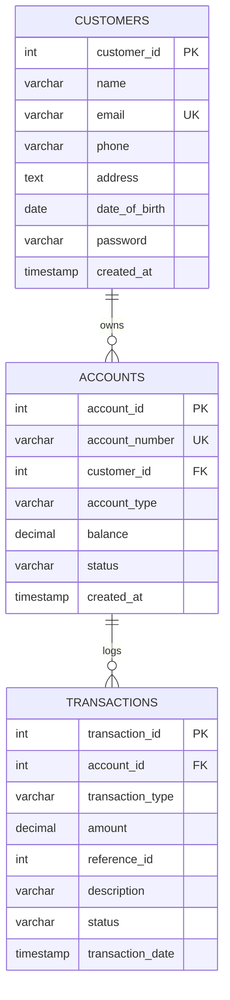

# 🏦 GenBank — Database & JDBC Integration Guide

This document explains the architecture of the GenBank database, how JDBC (Java Database Connectivity) is integrated across each architectural layer, and how you can access, inspect, and manage the database.

---

## 📑 Table of Contents
1. [Overview & Database Engine](#1-overview--database-engine)
2. [Database Schema & ER Model](#2-database-schema--er-model)
3. [How JDBC is Integrated](#3-how-jdbc-is-integrated)
   - [3.1 Layered Architecture](#31-layered-architecture)
   - [3.2 Connection Lifecycle & Driver Loading](#32-connection-lifecycle--driver-loading)
   - [3.3 SQL Injection Prevention with PreparedStatement](#33-sql-injection-prevention-with-preparedstatement)
   - [3.4 Object-Relational Mapping (ResultSet to Models)](#34-object-relational-mapping-resultset-to-models)
   - [3.5 ACID Transactions & Rollback Handling](#35-acid-transactions--rollback-handling)
4. [How to Access the Database](#4-how-to-access-the-database)
   - [Method 1: Via the Web Application (Recommended)](#method-1-via-the-web-application-recommended)
   - [Method 2: Launching the H2 Web Console GUI](#method-2-launching-the-h2-web-console-gui)
   - [Method 3: External Database Clients (DBeaver, IntelliJ, VS Code)](#method-3-external-database-clients-dbeaver-intellij-vs-code)
   - [Method 4: Programmatic Seeding and Inspection](#method-4-programmatic-seeding-and-inspection)
5. [Understanding the Embedded File Lock](#5-understanding-the-embedded-file-lock)

---

## 1. Overview & Database Engine

GenBank uses **H2 Embedded Database Engine** running in **MySQL compatibility mode**.

- **File-based Storage**: Data is saved to `banking_data.mv.db` in the project root directory.
- **Zero Server Setup**: Unlike MySQL or PostgreSQL, you do not need to install or start an external background database service. The Java application engine embeds the SQL engine directly.
- **Auto Schema Provisioning**: The database tables and indexes are automatically verified and created whenever the application initializes.
- **Data Persistence**: Changes, transactions, deposits, and new accounts survive server restarts because they are written directly to the MVStore database file on disk.

Configuration is defined in [`src/db.properties`](file:///d:/GenBank/MiniBankingSystem/src/db.properties):
```properties
db.url=jdbc:h2:file:./banking_data;MODE=MySQL;DB_CLOSE_DELAY=-1
db.user=sa
db.password=
```

---

## 2. Database Schema & ER Model

The database contains three core relational tables:



### Table Definitions
1. **`customers`**: Holds identity, login credentials, and contact information.
2. **`accounts`**: Stores account numbers (`ACC...`), balances (using `DECIMAL(15,2)` for financial precision), and status (`ACTIVE`, `INACTIVE`).
3. **`transactions`**: Immutable financial ledger tracking every `DEPOSIT`, `WITHDRAWAL`, and `TRANSFER`.

---

## 3. How JDBC is Integrated

### 3.1 Layered Architecture

The application strictly separates database operations from HTTP routing and business logic:

```
┌────────────────────────────────────────────────────────┐
│  Web Browser UI  (HTML5 / CSS / Vanilla JS)             │
└───────────────────────────┬────────────────────────────┘
                            │ JSON HTTP Requests
┌───────────────────────────▼────────────────────────────┐
│  API Handlers  (WebServer.java, api/AuthHandler.java)  │
└───────────────────────────┬────────────────────────────┘
                            │ DTOs / Method calls
┌───────────────────────────▼────────────────────────────┐
│  Business Layer  (service/BankingService.java)         │
│  - Enforces rules, validations, & ACID transactions    │
└───────────────────────────┬────────────────────────────┘
                            │ Passes Connection / Entities
┌───────────────────────────▼────────────────────────────┐
│  DAO Layer  (dao/CustomerDAO, AccountDAO, etc.)        │
│  - PreparedStatement, ResultSet mapping               │
└───────────────────────────┬────────────────────────────┘
                            │ Connection factory
┌───────────────────────────▼────────────────────────────┐
│  Driver Layer  (util/DBConnection.java)                │
│  - DriverManager, H2 Driver, Schema bootstrapping      │
└───────────────────────────┬────────────────────────────┘
                            │ File I/O
┌───────────────────────────▼────────────────────────────┐
│  Storage  (banking_data.mv.db)                         │
└────────────────────────────────────────────────────────┘
```

---

### 3.2 Connection Lifecycle & Driver Loading

Implemented in [`src/util/DBConnection.java`](file:///d:/GenBank/MiniBankingSystem/src/util/DBConnection.java):

1. **Driver Registration**: The static initializer loads the Type-4 H2 driver:
   ```java
   Class.forName("org.h2.Driver");
   ```
2. **Auto-Initialization**: During startup, `initSchema()` runs DDL statements (`CREATE TABLE IF NOT EXISTS`) using a standard `java.sql.Statement`.
3. **Connection Acquisition**:
   ```java
   public static Connection getConnection() throws SQLException {
       return DriverManager.getConnection(url, user, password);
   }
   ```
4. **Leak Prevention**: All DAOs and handlers use Java's `try-with-resources` construct to guarantee connections are closed even if an exception is thrown:
   ```java
   try (Connection conn = DBConnection.getConnection()) {
       // use connection
   } // conn is automatically closed here
   ```

---

### 3.3 SQL Injection Prevention with PreparedStatement

Never use raw string concatenation when executing SQL queries. All DAOs throughout `src/dao/` use `PreparedStatement`:

Example from [`src/dao/CustomerDAO.java`](file:///d:/GenBank/MiniBankingSystem/src/dao/CustomerDAO.java):
```java
String sql = "SELECT * FROM customers WHERE email = ?";

try (Connection conn = DBConnection.getConnection();
     PreparedStatement ps = conn.prepareStatement(sql)) {

    ps.setString(1, email); // Parameters are strongly typed & sanitized
    try (ResultSet rs = ps.executeQuery()) {
        if (rs.next()) {
            return mapRowToCustomer(rs);
        }
    }
}
```

---

### 3.4 Object-Relational Mapping (ResultSet to Models)

JDBC returns tabular data via `ResultSet`. DAOs map relational rows into strongly typed Java domain objects:

```java
private Customer mapRowToCustomer(ResultSet rs) throws SQLException {
    Customer c = new Customer();
    c.setCustomerId(rs.getInt("customer_id"));
    c.setName(rs.getString("name"));
    c.setEmail(rs.getString("email"));
    c.setPhone(rs.getString("phone"));
    c.setAddress(rs.getString("address"));
    c.setDateOfBirth(rs.getDate("date_of_birth").toLocalDate());
    c.setPassword(rs.getString("password"));
    c.setCreatedAt(rs.getTimestamp("created_at").toLocalDateTime());
    return c;
}
```

For autoincrement primary keys (`customer_id`, `account_id`, `transaction_id`), `Statement.RETURN_GENERATED_KEYS` is used:
```java
PreparedStatement ps = conn.prepareStatement(sql, Statement.RETURN_GENERATED_KEYS);
ps.executeUpdate();
try (ResultSet keys = ps.getGeneratedKeys()) {
    if (keys.next()) return keys.getInt(1);
}
```

---

### 3.5 ACID Transactions & Rollback Handling

Financial transfers require **atomicity**: debiting account A and crediting account B must both succeed or both fail together. 

In [`src/service/BankingService.java`](file:///d:/GenBank/MiniBankingSystem/src/service/BankingService.java), this is handled at the JDBC connection level:

```java
try (Connection conn = DBConnection.getConnection()) {
    // 1. Disable Auto-Commit to begin transaction block
    conn.setAutoCommit(false);

    try {
        // Step 1: Debit sender
        accountDAO.updateBalance(conn, fromAccount.getAccountId(), newSourceBalance);
        // Step 2: Credit recipient
        accountDAO.updateBalance(conn, toAccount.getAccountId(), newTargetBalance);
        // Step 3: Record transaction records
        transactionDAO.recordTransaction(conn, debitTx);
        transactionDAO.recordTransaction(conn, creditTx);

        // 2. Commit transaction if all steps succeeded
        conn.commit();

    } catch (SQLException e) {
        // 3. Roll back all changes if any query failed
        conn.rollback();
        throw e;
    } finally {
        conn.setAutoCommit(true); // Reset to default
    }
}
```

---

## 4. How to Access the Database

### Method 1: Via the Web Application (Recommended)
The web application running at **`http://localhost:8080`** provides live read/write access to the database:
- **Alice**: `alice@example.com` / `password123`
- **Bob**: `bob@example.com` / `password123`

You can perform transfers, deposit funds, or view the transaction ledger in real-time.

---

### Method 2: Launching the H2 Web Console GUI
H2 includes a browser-based SQL administration console.

> **Important**: Because H2 is an embedded database, only **one** process can hold the file lock at a time. If the GenBank web server is running, stop it first before opening the standalone console (or close the console before starting the web server).

To launch the H2 Web Console:
```powershell
$JAVA_HOME = "C:\Program Files\Java\jdk-21"
$H2_JAR = "C:\Users\prati\.m2\repository\com\h2database\h2\2.2.224\h2-2.2.224.jar"

& "$JAVA_HOME\bin\java.exe" -cp $H2_JAR org.h2.tools.Console
```
This opens your browser at `http://localhost:8082`. Enter the following login details:
- **Driver Class**: `org.h2.Driver`
- **JDBC URL**: `jdbc:h2:file:D:/GenBank/MiniBankingSystem/banking_data;MODE=MySQL`
- **User Name**: `sa`
- **Password**: *(leave blank)*

You can now run any SQL query (e.g., `SELECT * FROM CUSTOMERS;`, `SELECT * FROM ACCOUNTS;`).

---

### Method 3: External Database Clients (DBeaver, IntelliJ, VS Code)
You can connect your favorite SQL tool to inspect the tables:

| Setting | Value |
| :--- | :--- |
| **Database Type** | H2 Database (Embedded) |
| **Driver Class** | `org.h2.Driver` |
| **JDBC URL** | `jdbc:h2:file:D:/GenBank/MiniBankingSystem/banking_data;MODE=MySQL` |
| **Username** | `sa` |
| **Password** | *(empty)* |

---

### Method 4: Programmatic Seeding and Inspection
To inspect or re-seed test data programmatically, use [`src/TestDataGenerator.java`](file:///d:/GenBank/MiniBankingSystem/src/TestDataGenerator.java):

```powershell
$JAVA_HOME = "C:\Program Files\Java\jdk-21"
$CP = "d:\GenBank\MiniBankingSystem\target\classes;C:\Users\prati\.m2\repository\com\h2database\h2\2.2.224\h2-2.2.224.jar"

& "$JAVA_HOME\bin\java.exe" -cp $CP TestDataGenerator
```

---

## 5. Understanding the Embedded File Lock

H2 creates an internal lock file/lock record inside `banking_data.mv.db` when an application opens a connection:
- If a script or console prints: `Database may be already in use: "Locked by another process"`
- **Cause**: The GenBank `WebServer` process is currently holding the file lock.
- **Resolution**:
  1. Stop the web server process.
  2. Perform your manual DB tasks (console/script).
  3. Restart the web server with `run.bat` or via your IDE.
