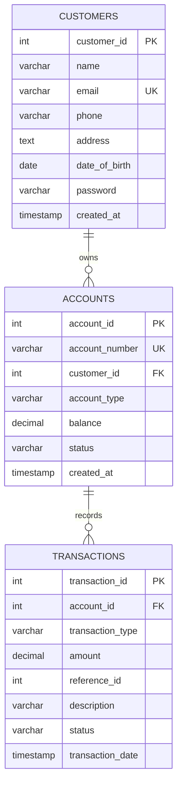

# GenBank Mini Banking System: Presentation Briefing

This document is a detailed, source-grounded overview of the GenBank Mini Banking System. It is intended to help a team explain the project and give a presentation-generating tool enough context to build an accurate slide deck. The system is an educational banking demo, not a production banking platform.

## 1. Project at a Glance

GenBank is a small Java banking application with both a browser-based interface and a separate console interface. It demonstrates customer registration and login, account lookup, deposits, withdrawals, transfers, and transaction history. The main technical teaching objective is to show how a Java application uses JDBC to persist and retrieve relational data, and how JDBC transactions keep related balance and ledger updates together.

The browser version runs locally at `http://localhost:8080`. It does not require a separately running MySQL server: the web application embeds H2 and stores data in a local database file. The Java code owns business rules and database access; the browser provides the user interface and calls the Java HTTP API.

## 2. Technology Stack

| Area | Technology in this project | Role |
|---|---|---|
| Programming language | Java; Maven compiler source/target is 17 | Business logic, API handlers, persistence code, and the optional console UI |
| Web server | Java built-in `com.sun.net.httpserver.HttpServer` | Serves the UI and handles API requests on port 8080 |
| Frontend | HTML5, CSS3, vanilla JavaScript | Login/registration, account dashboard, transaction list, and banking action forms |
| JSON | Gson 2.10.1 | Converts request and response JSON to/from Java data |
| Database | H2 2.2.224 embedded, file-backed | Stores customer, account, and transaction rows locally |
| Database access | JDBC API (`java.sql`) using H2's Type 4 driver | Connections, SQL statements, result sets, generated keys, and transaction control |
| Build/dependencies | Maven (`pom.xml`) | Declares dependencies, Java compiler target, resources, and executable packaging |
| Launch script | `run.bat` | Compiles source files, copies resources, and launches the web server |

There is no Spring Boot, Tomcat, ORM, Hibernate, JPA, frontend framework, or connection pool in the web application. The project also contains console menus under `src/ui`; the console application is a separate entry point from the browser server.

### Java version detail

The Maven compiler source and target properties are set to Java 17. The current Windows `run.bat` points to a JDK 21 installation. For a presentation, it is most accurate to say the code is configured for Java 17 language/bytecode compatibility and the provided script currently runs using JDK 21, rather than describing the setup simply as “Java 21.”

## 3. What a User Can Do

### Customer workflow

1. Open the application in a browser at `http://localhost:8080`.
2. Sign in using an existing customer email and password, or open an account using the registration form.
3. On successful sign-in or registration, view the account holder, account number, account type, status, and displayed balance.
4. Choose Deposit, Withdraw, or Transfer and submit an amount; a transfer also requires the destination account number.
5. Review the transaction history, which is requested from the API and displayed newest first.
6. Log out to clear the browser's session storage and return to the authentication screen.

Registration collects a name, email, phone, address, date of birth, password, and account type (`SAVINGS` or `CURRENT`). It creates a customer row and a linked account with a zero initial balance. The generated account number is ten digits and starts with `10`.

### Banking rules visible in the service layer

- Deposits and withdrawals must have a positive amount.
- A withdrawal or transfer cannot exceed the sender's current balance.
- A transfer requires a nonblank destination, cannot target the sender's own account, and cannot target a missing or inactive receiver account.
- Login rejects missing customers and inactive accounts.
- Account types are `SAVINGS` and `CURRENT`; account statuses are `ACTIVE` and `INACTIVE`.
- Amounts and balances use `BigDecimal`, avoiding binary floating-point arithmetic for money values.

### Admin and console scope

The repository includes a separate Java console interface. Its admin menu supports viewing records and toggling account status; the admin login credentials are hard-coded in `src/ui/AdminMenu.java`. These console admin functions are not exposed as admin screens or admin API routes in the browser application. Avoid describing the web UI as having an admin dashboard.

## 4. Architecture and Request Flow

The web application is organized into layers:

```text
Browser: HTML/CSS/JavaScript
        | JSON over HTTP
        v
Embedded Java HttpServer (port 8080)
  |-- StaticFileHandler serves web/index.html and static resources
  |-- API handlers parse requests and shape JSON responses
        v
Service layer: AuthService and BankingService
  |-- validates inputs and applies application/business rules
        v
DAO layer: CustomerDAO, AccountDAO, TransactionDAO
  |-- executes SQL, maps ResultSet rows to model objects
        v
DBConnection: JDBC driver, connections, and schema initialization
        v
H2 file database: banking_data.mv.db
```

### Example: sign-in request

1. The JavaScript `doLogin()` function sends email and password as JSON to `POST /api/login`.
2. `LoginHandler` parses the body using Gson and calls `AuthService.login()`.
3. `AuthService` asks `CustomerDAO` to match email and password, then asks `AccountDAO` for the customer's account and checks its status.
4. DAOs execute parameterized SQL using JDBC and return model objects.
5. The handler returns a JSON envelope with `success` and account data. The browser stores that response in `sessionStorage`, then renders the dashboard.

### Example: deposit request

1. The browser sends `POST /api/deposit` with the account number and amount.
2. `DepositHandler` validates the payload shape and converts the amount to `BigDecimal`.
3. It loads the account through `AccountDAO`, then calls `BankingService.deposit()`.
4. The service validates the amount, updates the account balance and inserts a transaction row using one JDBC connection and one transaction.
5. On success, the browser updates its displayed balance and reloads transaction history.

The JavaScript client uses same-origin relative `/api/...` URLs. API responses use JSON with a consistent success/error shape; handlers return HTTP status codes for cases such as invalid input, missing accounts, unsupported methods, and database errors.

## 5. HTTP API Surface

| Endpoint | Method | Purpose |
|---|---|---|
| `/api/register` | POST | Register a customer and create an account |
| `/api/login` | POST | Validate customer credentials and return account details |
| `/api/account?accountNumber=...` | GET | Look up account details by account number |
| `/api/deposit` | POST | Deposit funds and record a ledger row |
| `/api/withdraw` | POST | Withdraw funds and record a ledger row |
| `/api/transfer` | POST | Transfer funds between two accounts and record both sides |
| `/api/transactions?accountId=...` | GET | Return an account's transactions newest first |
| `/` and static paths | GET | Serve frontend resources from the classpath `web/` directory |

The API handlers live in `src/api`. `BaseHandler` centralizes Gson JSON parsing/serialization, response helpers, and CORS headers. `WebServer` registers API contexts and a static-file context, then uses a fixed thread pool of ten workers.

## 6. What Type of JDBC Is Used?

GenBank uses the standard JDBC API with the H2 JDBC driver, specifically H2's Type 4 driver (`org.h2.Driver`). A Type 4 driver is implemented in Java and translates JDBC calls directly for its database engine; it does not require an ODBC bridge or native client library. Here H2 is embedded in the application process, so database access is local rather than a network connection to a separate database server.

The configured URL is:

```properties
jdbc:h2:file:./banking_data;MODE=MySQL;DB_CLOSE_DELAY=-1
```

Important distinction: `MODE=MySQL` enables some MySQL-compatible SQL behavior in H2. It does not mean that the application is using MySQL or the MySQL JDBC driver. The active runtime database is H2. The separate `sql/schema.sql` file is a MySQL-oriented schema script for reference/manual use; the running Java application does not execute that file. Runtime schema setup is implemented in `DBConnection.initSchema()` using H2 connections and `CREATE TABLE IF NOT EXISTS` statements.

The application uses plain JDBC rather than an ORM. Developers can see the SQL statements and each connection/statement/result-set lifecycle directly in the DAO classes.

## 7. JDBC Integration in Detail

### Driver and connection initialization

`util.DBConnection` loads `db.properties` from the classpath, explicitly loads `org.h2.Driver` with `Class.forName(...)`, and uses `DriverManager.getConnection(url, user, password)` to create connections. Its static initialization also creates the three tables and indexes if they do not already exist. `WebServer` explicitly loads `util.DBConnection` during startup so initialization occurs before the server begins accepting requests.

Each DAO method that needs a normal read or write obtains a connection from `DBConnection`. Connections, statements, and result sets are generally wrapped in Java try-with-resources, so they close automatically when the block exits, including when an exception occurs.

### SQL execution and safe parameter binding

DAOs use `PreparedStatement` for parameterized queries and updates. Inputs are bound using typed setters such as `setString`, `setInt`, `setBigDecimal`, and `setDate`; values are not joined into SQL strings. This is the project's primary SQL injection prevention technique for user-supplied values.

Plain `Statement` is used for fixed SQL with no user-supplied parameters, such as schema initialization and list-all queries. Read queries execute through `executeQuery()` and return a `ResultSet`; inserts and updates use `executeUpdate()`.

### Generated keys and row mapping

Customer, account, and transaction inserts request generated primary keys using `Statement.RETURN_GENERATED_KEYS`. DAOs retrieve the generated value with `getGeneratedKeys()`.

DAOs map rows from `ResultSet` into Java model types:

- `Customer` represents a row from `customers`.
- `Account` represents a row from `accounts` and may include a joined customer name.
- `Transaction` represents a row from `transactions`.

Mapping converts SQL dates/timestamps into Java time types, uses `BigDecimal` for numeric balances, and maps database strings to Java enums for account type, status, transaction type, and transaction status.

### Transaction management and ACID behavior

The main JDBC teaching example is the transfer. A transfer must not leave the sender debited without also crediting the receiver and recording the corresponding ledger entries. The service obtains a single connection and disables auto-commit so all related statements belong to one database transaction:

```text
setAutoCommit(false)
  1. Verify destination account
  2. Update sender balance
  3. Update receiver balance
  4. Insert sender-side transfer record
  5. Insert receiver-side transfer record
  Success: commit()
  Failure: rollback()
```

Both `AccountDAO.updateBalance(...)` and `TransactionDAO.recordTransaction(...)` accept the existing `Connection` supplied by the service. This is essential: if they opened independent connections, the service could not commit or roll back the full operation as one unit. Deposit and withdrawal use the same pattern for their paired balance update and transaction insert.

This illustrates JDBC transaction control and atomicity for the statements on that connection. It should not be presented as a complete production-grade ledger or concurrency design; see the limitations section.

## 8. Relational Data Model

The runtime schema contains three core tables:



- `customers`: customer identity and contact fields, login email/password, and creation time. Email is unique.
- `accounts`: unique account number, owning customer foreign key, account type, `DECIMAL(15,2)` balance, status, and creation time. The application flow creates one account for a customer in this demo.
- `transactions`: account foreign key, operation type, amount, optional `reference_id` for a transfer counterpart, description, status, and timestamp. Transfers write one row for each account.
- Foreign keys connect account rows to customers and transaction rows to accounts. The schema defines cascade deletion for these relationships.
- Indexes are created for `accounts.customer_id` and `transactions.account_id` to support common lookups.

## 9. Persistence and Running the Application

H2 runs embedded and persists database state in a local file. The relative database path is resolved from the process working directory; when launched from the project root, H2 creates `banking_data.mv.db` there. This is why data remains after the application is stopped and started again.

The normal Windows demo path is:

1. Run `run.bat` from the project setup.
2. The script compiles Java files into `target/classes`, copies `db.properties` and the `web/` assets, then launches `WebServer` with H2 and Gson on the classpath.
3. Browse to `http://localhost:8080`.
4. Stop the process with Ctrl+C.

H2 embedded mode takes a file lock while open. A standalone H2 console or another process may report that the database is already in use while GenBank is running. Stop the web server before opening the same file in another database process, then close that process before restarting the app.

## 10. User Interface and Visual Design

The frontend is currently a single `web/index.html` file containing the page markup, CSS, and vanilla JavaScript. Its neoclassical background is inspired by a historic European hall: a sepia-lit vaulted ceiling with ribs, columns, and a receding stone floor. Translucent sandstone panels and warm borders blend with that background. Cormorant Garamond is used for display headings, while Inter remains the interface text font. Lucide line icons replace decorative emoji and are loaded from a pinned CDN release. Tactile button geometry and hover/press behavior remain, with higher-contrast forest, teal-green, oxblood, and stone fills. The UI includes login and registration tabs, account details, deposit/withdraw/transfer dialogs, messages, notifications, and transaction history. It does not show live market data.

The browser stores the current account response in `sessionStorage` under `genbank_session`. This lets the dashboard reappear after a page refresh in the same browser tab/session, and it is cleared by logout or when the tab session ends. It is a frontend state snapshot, not a server-issued, cryptographically validated authentication token.

## 11. Demo Limitations and Accuracy Notes

These points matter when presenting the project to teammates or an audience:

- **Not production banking software.** It is a learning/demo application illustrating JDBC, basic banking flows, and a local database.
- **Passwords are stored as plain text.** Registration writes the supplied password directly, and login compares it directly. A production system must use a modern salted password hash and a proper authentication/session design.
- **The web API does not enforce an authenticated user session.** Several operations accept account numbers or account IDs from the request, and the `sessionStorage` object is client-controlled. A production API must authenticate and authorize every operation on the server.
- **CORS is permissive.** The shared API handler returns `Access-Control-Allow-Origin: *`; production deployment should use a deliberate origin policy and other appropriate web protections.
- **No server-side session/token mechanism is shown.** Browser login is a UI flow around returned account data, not an authorization boundary.
- **Transfer concurrency needs stronger protection for production.** The demo checks balance and calculates new balances from a previously loaded account object; production banking requires carefully designed locking/conditional updates, isolation, idempotency, and audit controls to prevent concurrent requests from causing incorrect balances.
- **Demo data and credentials are not secrets.** Sample passwords and console admin credentials are for local demonstration only and must never be reused in a deployed system.
- **H2's MySQL compatibility mode is not MySQL.** The runtime database remains local H2, and the standalone MySQL schema file is not the app's startup schema source.
- **The ledger is operational demo data, not an immutable audit ledger.** Database foreign keys cascade deletes, and the app does not demonstrate a compliance-grade append-only audit system.

These caveats are useful to frame the project as an academic demonstration and to invite a future-work slide rather than imply the application is ready for real financial use.

## 12. Suggested Presentation Flow

This outline can be used to build a slide deck:

1. **Title and objective:** GenBank Mini Banking System; demonstrate Java, JDBC, relational persistence, and basic banking flows.
2. **Problem and scope:** local educational bank demo; explain the customer tasks it supports and what is outside scope.
3. **Technology stack:** Java, built-in HttpServer, HTML/CSS/vanilla JS, Gson, JDBC, embedded H2, Maven.
4. **Architecture:** browser → HTTP API handlers → services → DAOs → JDBC/H2 file.
5. **Website walkthrough:** registration/login, dashboard, deposit/withdraw/transfer, transaction history.
6. **Data model:** customers, accounts, transactions, primary/foreign keys, and transfer references.
7. **JDBC type and connection lifecycle:** Type 4 H2 driver, `DriverManager`, `Connection`, statements, result sets, and try-with-resources.
8. **Prepared statements and mapping:** bind parameters; map `ResultSet` data to model objects; retrieve generated IDs.
9. **Transfer transaction:** show `setAutoCommit(false)`, paired balance updates and ledger inserts, then commit or rollback.
10. **Persistence and demo:** H2 file survives restarts; local startup URL and sample/customer setup.
11. **Limitations and future work:** password hashing, proper server-side authentication/authorization, concurrency safeguards, production database/deployment, and tests.
12. **Conclusion/Q&A:** summarize how a user action travels from the browser into durable relational storage.

## 13. Source Map for Presenters

| Topic | Main source files |
|---|---|
| Web server setup and routes | `src/WebServer.java` |
| Database URL, driver loading, schema bootstrap | `src/db.properties`, `src/util/DBConnection.java` |
| Customer validation and registration/login | `src/service/AuthService.java`, `src/dao/CustomerDAO.java` |
| Deposit, withdrawal, transfer rules/transactions | `src/service/BankingService.java` |
| Account and transaction SQL | `src/dao/AccountDAO.java`, `src/dao/TransactionDAO.java` |
| HTTP request/response handlers | `src/api/` |
| Browser interface and fetch calls | `web/index.html` |
| Data model classes | `src/model/` |
| Build dependencies and Java compiler target | `pom.xml` |
| Windows compile-and-run workflow | `run.bat` |
| MySQL-oriented schema reference (not runtime bootstrap) | `sql/schema.sql` |
| Existing JDBC-specific guide | `DATABASE_AND_JDBC_GUIDE.md` |
